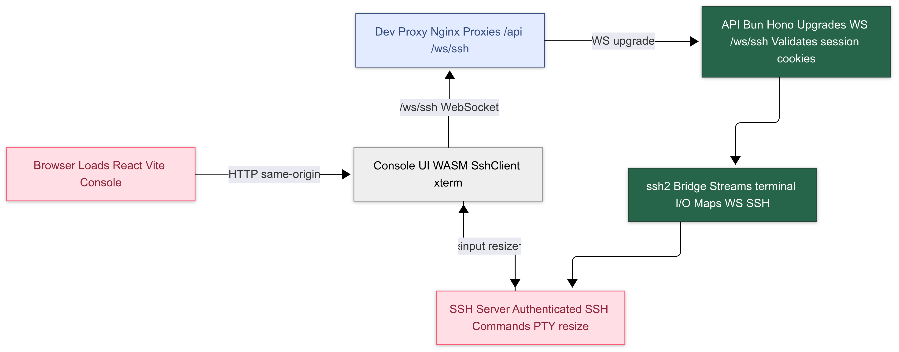

# 🚀 Conn‑PTY

A modern, WASM‑powered SSH console with real‑time WebSocket transport, a slick React UI, and a Bun‑based API. Manage servers, credentials, and sessions — all from your browser. 🧑‍💻✨

## 🌟 Highlights
- ⚙️ WASM SSH client with raw WebSocket fallback
- 🖥️ Beautiful console UI using xterm.js with custom brand theme
- 🔌 Bun API using Hono, with secure session activation and ssh2 bridge
- 🧩 Monorepo with Turborepo for consistent builds

## 🧭 Architecture & Flow
The high‑level flow from your browser to the SSH server:



1. 🌐 Browser loads the Console app (Vite dev or Nginx prod)
2. 🧠 Console’s Terminal initializes the WASM SshClient and connects via `ws(s):///ws/ssh?session_id=...`
3. 🔌 API upgrades the WebSocket and activates the session, building SSH config
4. 🔐 API bridges WebSocket messages to ssh2 and streams terminal I/O
5. ⌨️ User input, resizing, and status/errors flow bidirectionally in real time

## 🚀 Self‑Hosting
To host Conn‑PTY yourself:

```yaml
services:
  api:
    image: ghcr.io/bravo68web/conn-pty:latest
    environment:
      - NODE_ENV=production
      - OIDC_ISSUER
      - OIDC_CLIENT_ID
      - OIDC_CLIENT_SECRET
      - OIDC_REDIRECT_URI
    restart: unless-stopped
    volumes:
      - db:/app/data

volumes:
  db:
    driver: local
```

## 📦 Packages
- packages/api — Bun/Hono API, WebSocket SSH handler → ./packages/api
- packages/console — React/Vite UI, xterm, WASM client integration → ./packages/console
- packages/ssh-client-wasm — Rust → WASM SshClient (via wasm‑pack) → ./packages/ssh-client-wasm

## 🛠️ Development
Prereqs: Bun, Node, Rust (for WASM), wasm‑pack.

- Start API (dev):
  - `cd packages/api && bun run dev` → http://localhost:3000
- Start Console (dev):
  - `cd packages/console && bun run dev` → http://localhost:8080
- Console dev proxies:
  - REST: `/api` → `http://localhost:3000`
  - WebSocket: `/ws/ssh` → `ws://localhost:3000`

## ⚙️ Configuration
Key environment variables (API):
- `OIDC_ISSUER`, `OIDC_CLIENT_ID`, `OIDC_CLIENT_SECRET`, `OIDC_REDIRECT_URI` for authentication

## 🤝 Contributing
- Fork, branch, and open PRs
- Keep commits scoped and descriptive
- Write secure code (never commit secrets)

## 📝 License
MIT — free to use, modify, and distribute.

Made with ❤️ by [@bravo68web](https://github.com/bravo68web)